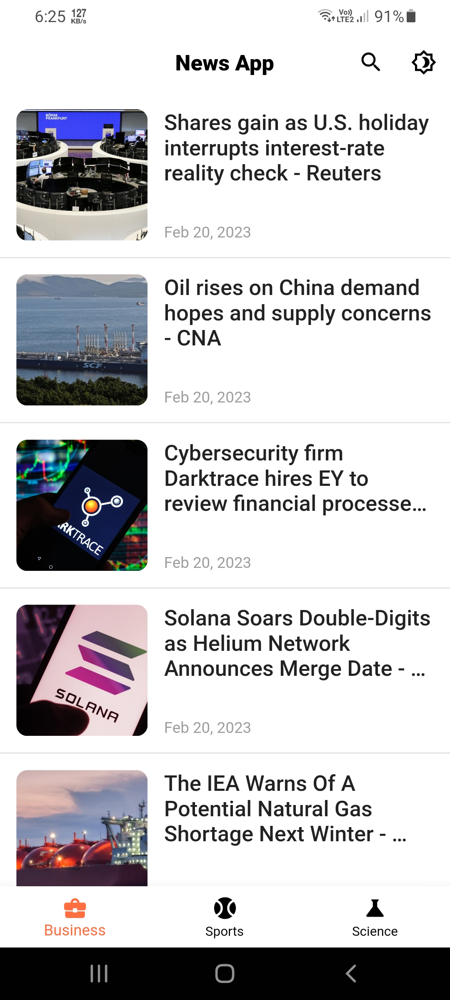
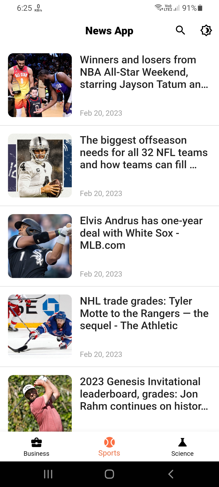
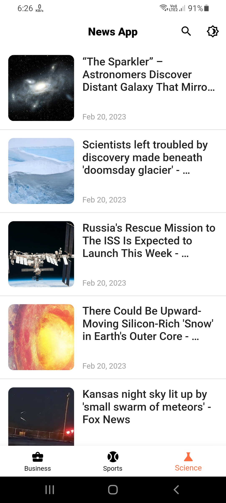
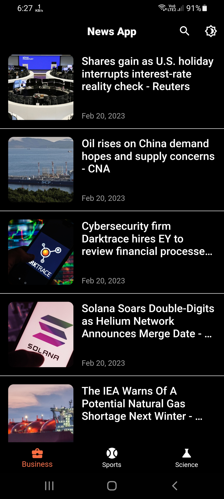
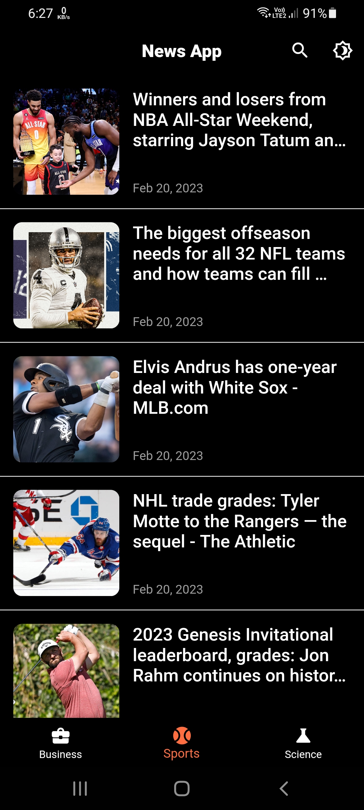
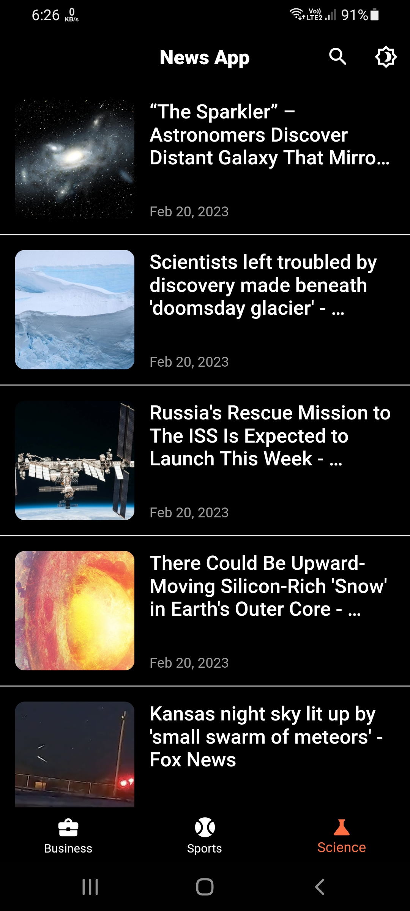

# news_app 📰🆕

An application with a good user interface, response to screens and measurements, and updated scientific and sporting news. The data was obtained from an external API. Depending on Bloc (Cubit) as State Management.

<div align="center">

[](#)
[](https://github.com/a7madZ3Dev/News_app/fork)
[](https://github.com/a7madZ3Dev/News_app/issues)
[](#)

</div>

## 💻 Installation steps

- Updated to `Flutter 2.10.3` Now!
- Dart SDK `2.18` with Sound Null Safety!
- Go to this <a href="https://newsapi.org/">website.</a>, and get your Key for doing requests.

Open CMD where you want to clone the project & run the following commands

```
git clone https://github.com/a7madZ3Dev/News_app.git
cd News_app
flutter packages get
flutter run
```

<br>

## 📱 Screen Shots 
### 🌞 Light Mode Theme
  

### 🌜 Dark Mode Theme

  

## 🎥 Promo Video

 
  


## 🔗 API Information

API Used: https://newsapi.org/

## 🎯 Features

✅ Search by word

✅ Go to the source of the news 

✅ Dark Mode
<br>

## 🔑 License

- This project is licensed under the MIT License - see the [LICENSE](LICENSE.md) file for details

## 🧑 Author

#### Ahmad Alzoabi
[](https://www.linkedin.com/in/ahmad-al-zoabi-0623a8233/)

You can also follow my GitHub Profile to stay updated about my latest projects:

[](https://github.com/a7madZ3Dev)

If you liked the repo then kindly support it by giving it a star ⭐!

Copyright (c) 2023 Ahmad Alzoabi

## Visitors Count


